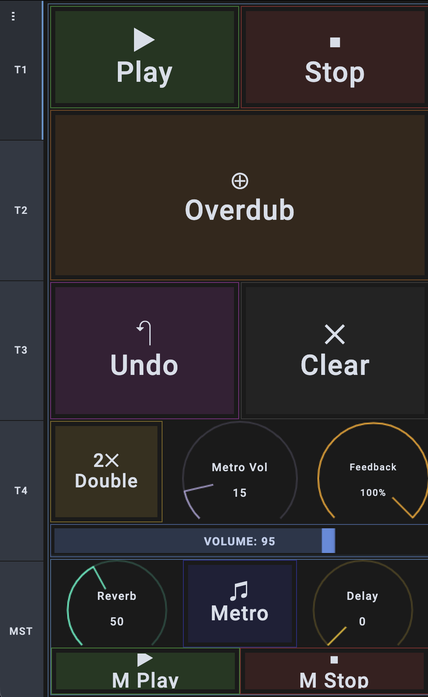
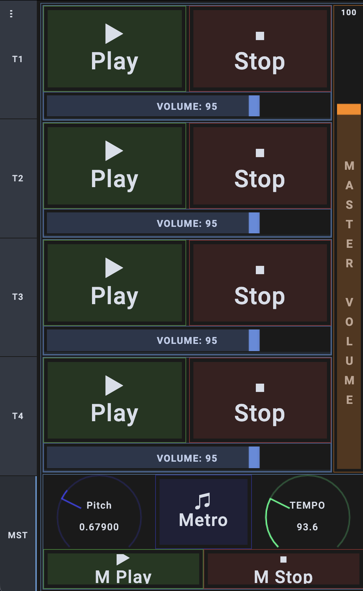
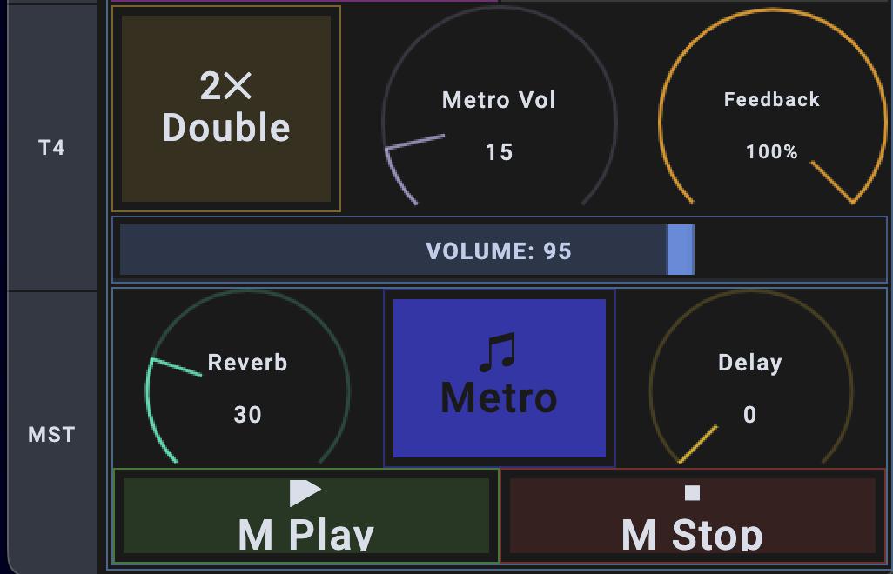
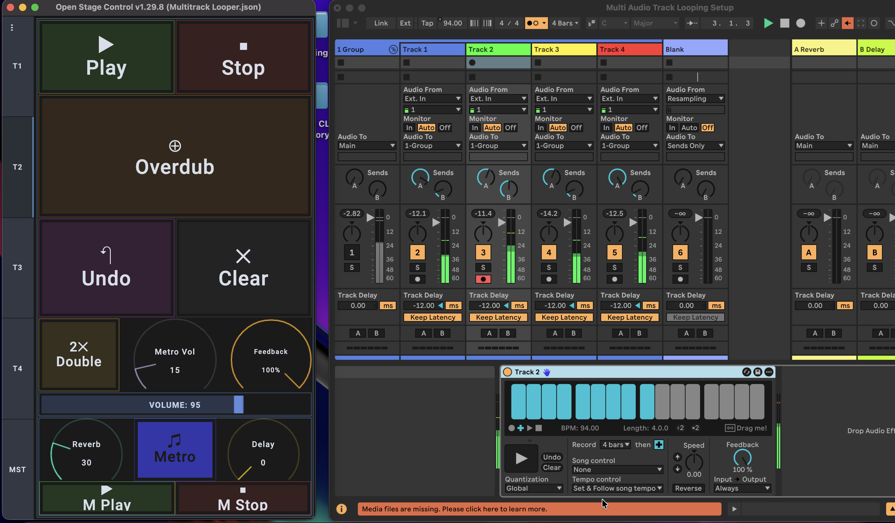

# TouchLooper - 4-Track MIDI Looper Controller

> Smartphone-based MIDI controller for live music looping with Ableton Live

[](LICENSE)


## 🎵 Overview

TouchLooper is a professional touchscreen MIDI controller built with Open Stage Control for controlling a 4-track looper system in Ableton Live. Designed for live keyboard performances requiring hands-free loop control.


**Built by Swarnadip Kar From IIT Bhilai**

## ✨ Features

### Four Independent Track Controllers
- **Complete loop control**: Play, Stop, Overdub, Undo, Clear for each track
- **FX controls**: Per-track Reverb and Delay with real-time knobs
- **Volume management**: Individual track volumes with visual faders
- **Feedback control**: Adjustable loop decay per track

### Master Control Tab
- **Looper Speed**: Global loop speed control (-3.00 to +3.00 semitones)
- **Master Tempo**: BPM control for synchronized loops
- **Master Volume**: Control all tracks simultaneously
- **Global Controls**: Master Play/Stop/Metronome accessible from all tabs

### Performance-Optimized Design
- **Touch-optimized UI**: Large buttons (15-25% screen height) for live performance
- **Color-coded interface**: Green (play), Red (stop), Orange (overdub), Purple (undo)
- **5-tab interface**: 4 track controllers + 1 master control
- **40+ MIDI signals**: Properly mapped without conflicts

## 🎯 Motivation

As performing musicians, we needed hands-free control of looping setups during live performances. Commercial MIDI controllers cost ₹15,000-50,000 and lacked specific workflow requirements.

**This solution:**
- ✅ Runs on any smartphone/tablet (₹0 cost)
- ✅ Completely customizable layout
- ✅ More flexible than hardware controllers
- ✅ Professional-grade reliability for live performance

## 🛠️ Tech Stack

- **Open Stage Control** v1.29.8 - Touch OSC/MIDI interface framework
- **MIDI Protocol** - Notes (57-83) and CC messages (1-102)
- **OSC Protocol** - WebSocket communication layer
- **JSON** - Configuration and data structure
- **Ableton Live** - DAW integration (compatible with any MIDI DAW)

## 📸 Screenshots

### Track Control Interface

*Individual track controls with Play, Stop, Overdub, Undo, Clear, and FX*

### Master Control Tab

*Global controls including looper speed, tempo, and master volume*

### FX Panel

*Reverb and delay controls with global metronome*

### Live Performance

*In action during practice session*

## 🚀 Quick Start

### Prerequisites

- [Open Stage Control](https://openstagecontrol.ammd.net/) v1.29.8+
- Ableton Live (or any MIDI-capable DAW)
- Virtual MIDI Port:
  - **Windows**: [loopMIDI](https://www.tobias-erichsen.de/software/loopmidi.html)
  - **macOS**: IAC Driver (built-in)
  - **Linux**: ALSA (built-in)
- Smartphone/Tablet (optional for remote control)

### Installation

```bash
# Clone repository
git clone https://github.com/yourusername/touchlooper.git
cd touchlooper

# Launch Open Stage Control
open-stage-control -p 8080 -s "midi:YOUR_MIDI_PORT"

# Example for Windows with loopMIDI
open-stage-control -p 8080 -s "midi:loopMIDI Port"

# Example for macOS
open-stage-control -p 8080 -s "midi:IAC Driver Bus 1"
```

### Access Interface

**Local:** `http://localhost:8080`  
**Remote:** `http://YOUR_COMPUTER_IP:8080` (from smartphone)

Load `Multitrack-Looper.json` in the browser interface.

📖 **Detailed setup**: [docs/setup-guide.md](docs/setup-guide.md)

## 📋 MIDI Signal Reference

### Track Controls (MIDI Notes)

| Control | T1 | T2 | T3 | T4 |
|---------|-------|-------|-------|-------|
| **Play** | 60 | 66 | 72 | 78 |
| **Stop** | 61 | 67 | 73 | 79 |
| **Overdub** | 62 | 68 | 74 | 80 |
| **Undo** | 64 | 70 | 76 | 82 |
| **Clear** | 65 | 71 | 77 | 83 |

### Track Controls (MIDI CC)

| Control | T1 | T2 | T3 | T4 |
|---------|-------|-------|-------|-------|
| **Volume** | CC 7 | CC 8 | CC 9 | CC 10 |
| **Feedback** | CC 11 | CC 12 | CC 13 | CC 14 |
| **Reverb** | CC 91 | CC 94 | CC 97 | CC 100 |
| **Delay** | CC 92 | CC 95 | CC 98 | CC 101 |
| **Double** | CC 93 | CC 96 | CC 99 | CC 102 |

### Master Controls (All Tabs)

| Control | MIDI Signal | Range | Description |
|---------|-------------|-------|-------------|
| **Global Play** | Note 58 | 0/127 | Start all tracks |
| **Global Stop** | Note 57 | 0/127 | Stop all tracks |
| **Global Metronome** | Note 59 | 0/127 | Toggle metronome |
| **Looper Speed** | CC 20 | 3-124 | Loop speed (-3.00 to +3.00) |
| **Master Tempo** | CC 1 | 0-127 | Global BPM control |

**All signals on MIDI Channel 1**

Full reference: [docs/midi-mappings.md](docs/midi-mappings.md)

## 🎨 Design Decisions

### Five-Tab Architecture
- **T1-T4**: Individual track controls with identical layouts
- **MST**: Master controls for global parameters
- Consistent UI pattern across all track tabs for muscle memory

### Looper Speed Range (3-124)
The speed knob uses range 3-124 instead of 0-127 because:
- Values 0-2 produce asymmetric -3.20, -3.15, -3.10 (non-standard)
- Values 125-127 exceed +3.00 limit
- Range 3-124 provides symmetric -3.00 to +3.00 semitone control

### MIDI Mapping Strategy
- **Notes for buttons**: Toggle/momentary actions (Play, Stop, Overdub)
- **CC for continuous**: Knobs and faders (Volume, Reverb, Speed)
- **Sequential numbering**: Track 1 (60-65), Track 2 (66-71), etc.

### Root OnTouch Code
The root contains commented-out tab-switching code:
```javascript
// Disabled during MIDI mapping to prevent ghost signals
// Enable after mapping complete for automatic track focusing
```

## 🎭 Use Cases

### Live Performance
Build layered loop compositions in real-time while playing keyboard, with complete hands-free control of all 4 tracks.

### Practice & Jamming
Quick loop recording over chord progressions, instant overdubbing, and easy undo for experimentation.

### Music Production
Sketch ideas rapidly, control loop speed for creative effects, manage multiple simultaneous loops.

### Teaching & Demonstration
Visual interface for teaching looping concepts, demonstrating live performance techniques.

## 🔧 Customization

Edit `Multitrack-Looper.json` to customize:

### Change Button Colors
```json
"colorWidget": "rgba(64, 255, 64, 0.8)"  // Green play button
```

### Adjust Layout Positions
```json
"top": "0%",
"left": "0",
"width": "50%",
"height": "15%"
```

### Remap MIDI Signals
```json
"preArgs": [1, 60]  // Channel 1, Note 60
```

## 📂 Project Structure

```
touchlooper/
├── README.md
├── LICENSE
├── .gitignore
├── Ableton Projects/
│   └── Multi Audio Track Looping Setup.als
├── archive/
│   └── ... (old backups and variations)
├── docs/
│   ├── CHANGELOG.md
│   ├── CONTRIBUTING.md
│   ├── midi-mappings.md
│   ├── setup-guide.md
│   ├── TODO.md
│   └── VERSION_MANAGEMENT.md
├── images/
│   ├── ... (interface screenshots)
├── profiles/
│   ├── Multitrack Looper.json
│   ├── Multitrack Looper (latest).json
│   ├── Notes For Multitrack Looper Mapping.txt
│   └── Single Track Looper.json
└── versions/
    └── ... (versioned session files)
```

## 📈 Technical Achievements

- **40+ MIDI signals** properly routed without conflicts
- **Responsive touch interface** optimized for 7-10 inch screens
- **Real-time control** with <5ms latency
- **Cross-platform** support (Windows, macOS, Linux, iOS, Android)
- **Zero-cost solution** using free open-source software

## 🐛 Known Issues & Solutions

**Issue**: Ghost signals during MIDI mapping  
**Solution**: Root onTouch code is commented out by default

**Issue**: Speed knob edge values  
**Solution**: Range limited to 3-124 for symmetric control

See [CHANGELOG.md](CHANGELOG.md) for version history and fixes.

## 🤝 Contributing

Contributions welcome! See [CONTRIBUTING.md](CONTRIBUTING.md) for guidelines.

Suggestions for improvements:
- Visual feedback for loop recording status
- Preset save/recall system
- Support for 8+ tracks
- Gesture controls (long-press, swipe)

## 📄 License

MIT License - see [LICENSE](LICENSE) file for details.

## 🙏 Acknowledgments

- [Open Stage Control](https://openstagecontrol.ammd.net/) by Jean-Emmanuel Doucet
- IIT Bhilai Music Club (Swara) for performance testing opportunities
- Ableton for excellent MIDI implementation

## 📊 Project Stats

- **Lines of JSON**: ~5,000
- **Total Widgets**: 50+
- **MIDI Signals**: 40+
- **Tabs**: 5 (4 tracks + 1 master)
- **Development Time**: 3 weeks
- **Platform Compatibility**: 6 (Windows, macOS, Linux, iOS, Android, Web)

---

## ⚙️ Configuration File Path

For manual configuration, such as updating the Open Stage Control launcher, you can find the configuration file at the following location:

-   **Path**: `/Users/swarnadipkar/Library/Preferences/open-stage-control`
-   **Config File**: `/Users/swarnadipkar/Library/Preferences/open-stage-control/config.json`

This is useful for applying advanced customizations or troubleshooting.

---

⭐ **If this project helped you, please star it!**

**Built with ❤️ for the live looping community**

*Developed by Swarnadip Kar | IIT Bhilai*
